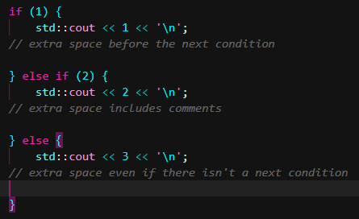
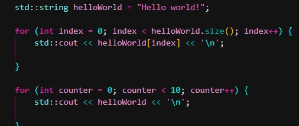
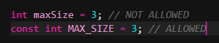
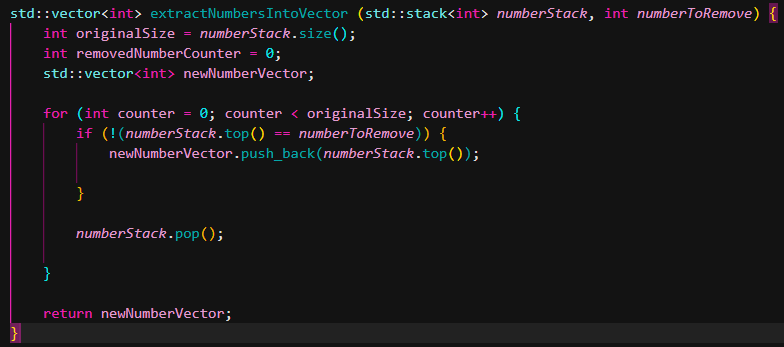
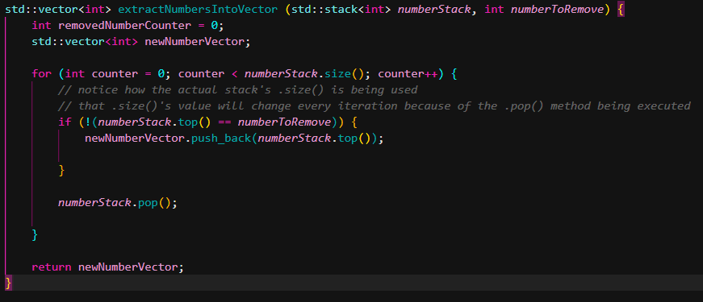
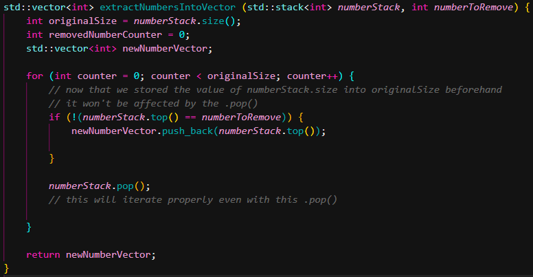
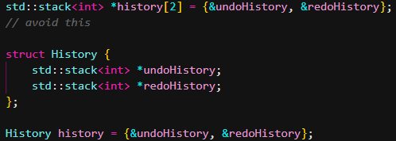
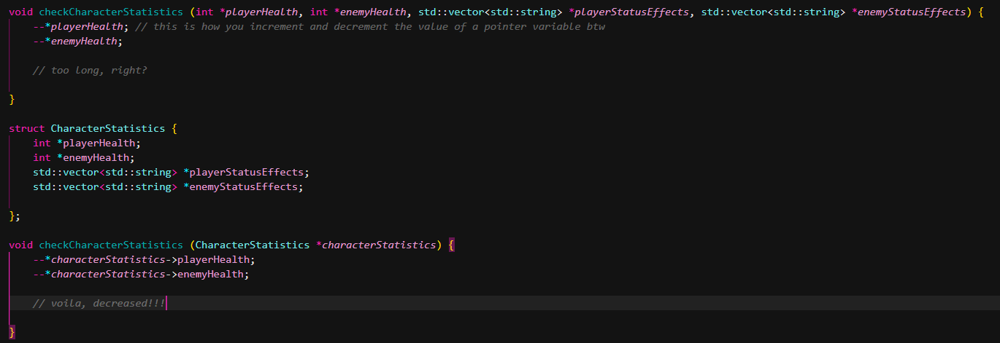
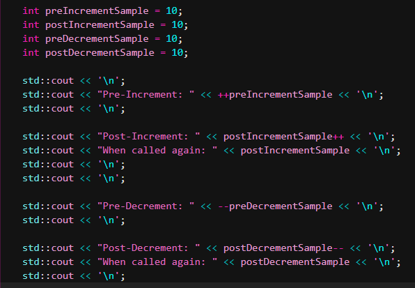
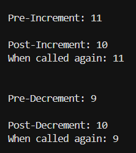

## Style Guide 

- camelCase for *regular variables* and *function* names.

- CAPITAL_SNAKE_CASE for *const* and *constexpr variables*.

- TitleCase for *classes* and *structs*.

- kebab-case for *file* and *folder* names.

- Use nouns for *variable*, *class*, and *struct* names.

- Use verbs for the first word of every *function* and *method* name ("is", "does" are verbs btw).

- If the object *method* only serves to return the value of an object *member*, you can use the *member* name even if its a noun.

- Format your *if-else* statements like this:

  

- **BE DESCRIPTIVE WITH YOUR NAMES**. Do not use single letter names like *i* for *for loops*. At least use the name *index* if you're using the *for loop* to access an array or array-like object, or *counter* for when you just need to loop a certain amount of times.

  
  

## Coding Guide

- **NO NON-CONSTANT GLOBAL VARIABLES**. If you need a *global variable* that changes, just declare it at *main()* and add it as a parameter in whatever function you need it for.

  

- Initialize all variables in your function at the beginning of your function. You can assign them later if they don't need to be assigned anything for now.
  
  

- Also, when running a data structure that can change size through a loop that uses its size as part of its condition, **DO NOT ADD A BLOCK CODE THAT WILL ALTER ITS SIZE INSIDE THE LOOP**.

  
  

- If a *struct* could do the job, just use a *struct*. Avoid using *array[]*. I've had a lot of trouble using *array[]* in my last project. I'm kinda traumatized. Just use *std::array* instead if you really need one.

  

- If you feel your function is taking too many parameters, make a struct to store those parameters in instead.

   

- There are two types of *increment* (++) / *decrement* (--) operators which depends on their placement on the variable: *pre-* and *post-*. In *pre-*, the value is first incremented/decremented before being used while in *pro-*, the value is first used before being incremented/decremented.
   
   

  
